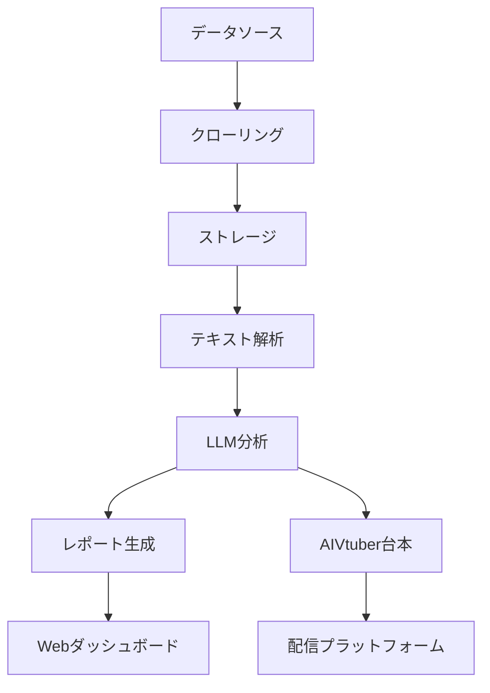

# 機能要件定義書

## 1. システム概要

### 1.1 システム構成

### 1.2 主要コンポーネント
1. データ収集システム
2. テキスト解析エンジン
3. LLM分析システム
4. レポート生成エンジン
5. Webダッシュボード
6. AIVtuber配信システム

## 2. 機能一覧

### 2.1 データ収集機能
| 機能ID | 機能名 | 優先度 | 説明 |
|--------|--------|--------|------|
| F01-01 | TDnetクローリング | 高 | TDnetから新着IR情報を自動取得 |
| F01-02 | EDINET収集 | 高 | EDINETから有価証券報告書を取得 |
| F01-03 | 企業サイト収集 | 中 | 各企業サイトからプレスリリース収集 |
| F01-04 | ファイル保存 | 高 | PDF/HTMLをクラウドストレージに保存 |
| F01-05 | メタデータ管理 | 高 | 企業情報・文書情報のDB管理 |

### 2.2 テキスト解析機能
| 機能ID | 機能名 | 優先度 | 説明 |
|--------|--------|--------|------|
| F02-01 | PDF→テキスト変換 | 高 | PDFからテキストを抽出 |
| F02-02 | OCR処理 | 中 | 画像ベースPDFのテキスト化 |
| F02-03 | テキスト前処理 | 高 | 不要文字除去、フォーマット統一 |

### 2.3 LLM分析機能
| 機能ID | 機能名 | 優先度 | 説明 |
|--------|--------|--------|------|
| F03-01 | テキスト要約 | 高 | 文書の要点抽出・要約生成 |
| F03-02 | キーワード抽出 | 高 | 重要キーワードの抽出 |
| F03-03 | センチメント分析 | 中 | ポジ/ネガ分析 |
| F03-04 | 企業間比較 | 低 | 同業他社との比較分析 |

### 2.4 レポート生成機能
| 機能ID | 機能名 | 優先度 | 説明 |
|--------|--------|--------|------|
| F04-01 | テンプレート管理 | 高 | レポートテンプレートの管理 |
| F04-02 | HTML生成 | 高 | Web表示用HTMLの生成 |
| F04-03 | PDF生成 | 中 | ダウンロード用PDF生成 |
| F04-04 | Note投稿 | 低 | 外部メディアへの投稿 |

### 2.5 Webダッシュボード機能
| 機能ID | 機能名 | 優先度 | 説明 |
|--------|--------|--------|------|
| F05-01 | ユーザー認証 | 高 | ログイン/会員登録 |
| F05-02 | レポート一覧 | 高 | レポートの検索・閲覧 |
| F05-03 | ウォッチリスト | 中 | 関心企業の管理 |
| F05-04 | 通知設定 | 中 | 新着レポート通知 |

### 2.6 AIVtuber機能
| 機能ID | 機能名 | 優先度 | 説明 |
|--------|--------|--------|------|
| F06-01 | 台本生成 | 高 | LLM結果から配信台本作成 |
| F06-02 | キャラクター管理 | 高 | Live2D/3Dモデル管理 |
| F06-03 | 配信連携 | 中 | YouTube/Twitch連携 |
| F06-04 | コメント対応 | 低 | リアルタイムQ&A生成 |

## 3. 画面一覧

### 3.1 ユーザー向け画面
1. トップページ
   - サービス概要
   - 新着レポート
   - ログイン/会員登録

2. ダッシュボード
   - レポート一覧
   - 検索機能
   - フィルター機能

3. レポート詳細
   - 要約表示
   - 原文PDF表示
   - 関連企業情報

4. ウォッチリスト
   - 登録企業一覧
   - 新着通知設定

5. ユーザー設定
   - プロフィール編集
   - プラン変更
   - 通知設定

### 3.2 管理者向け画面
1. 管理ダッシュボード
   - システム状態監視
   - ユーザー管理
   - コンテンツ管理

2. クローリング管理
   - 実行状況確認
   - スケジュール設定
   - エラー確認

3. AIVtuber管理
   - 台本生成・編集
   - 配信スケジュール
   - コメント管理

## 4. 外部システム連携

### 4.1 API連携
1. OpenAI API
   - GPT-4による要約・分析
   - エラー時のフォールバック

2. AWS/GCPサービス
   - S3/GCSでのファイル保存
   - Lambda/Cloud Functionsでの処理

3. 決済サービス
   - Stripeによる課金処理
   - 請求書生成

### 4.2 外部プラットフォーム連携
1. YouTube
   - ライブ配信API
   - チャット取得API
   - スーパーチャット処理

2. Note
   - 記事投稿API
   - 統計情報取得

## 5. 非機能要件

### 5.1 パフォーマンス要件
1. レスポンス時間
   - ページ表示：3秒以内
   - 検索結果：2秒以内
   - PDF表示：5秒以内

2. 同時接続数
   - 通常時：100ユーザー
   - ピーク時：1,000ユーザー

3. データ処理量
   - 1日あたりの新規文書：1,000件
   - 1日あたりのLLM処理：5,000件

### 5.2 セキュリティ要件
1. 認証・認可
   - JWTによるトークン認証
   - ロールベースアクセス制御

2. データ保護
   - 通信の暗号化（HTTPS）
   - 個人情報の暗号化

3. 監査
   - アクセスログの保存
   - 操作履歴の記録

### 5.3 可用性要件
1. サービス稼働時間
   - 24時間365日
   - 計画メンテナンス除く

2. バックアップ
   - DBの日次バックアップ
   - ファイルの世代管理

3. 障害対策
   - 自動フェイルオーバー
   - 冗長構成

## 6. 制約条件

### 6.1 法的制約
1. 投資助言・代理業規制
   - 投資助言とならない範囲での情報提供
   - 免責事項の明示

2. 著作権
   - IR資料の引用範囲
   - 企業ロゴ使用許諾

### 6.2 技術的制約
1. ブラウザ対応
   - Chrome/Safari/Firefox最新版
   - IE11は非対応

2. デバイス対応
   - PC/タブレット/スマートフォン
   - 画面サイズ最適化

### 6.3 運用制約
1. メンテナンス時間
   - 深夜1-5時
   - 月1回程度

2. サポート体制
   - メール対応（平日10-18時）
   - チャットボット（24時間） 