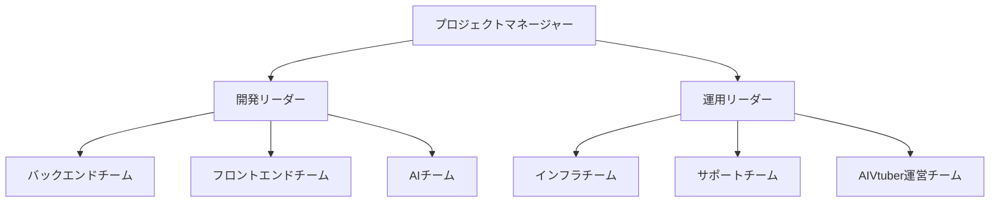
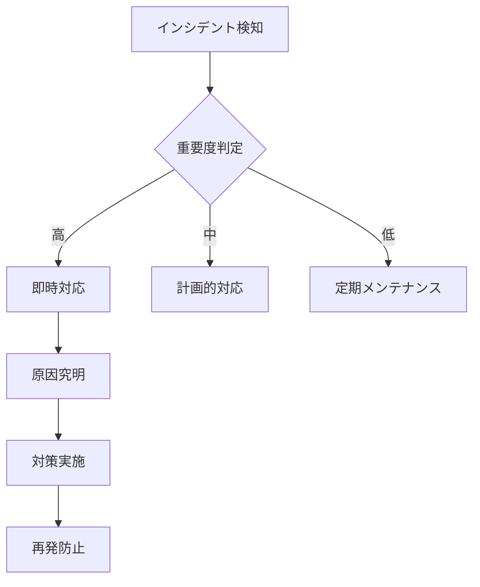
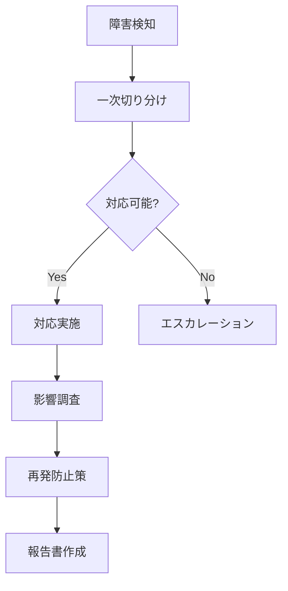
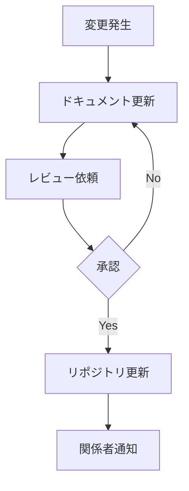

# 運用・保守計画書

## 1. 運用体制

### 1.1 組織体制


### 1.2 役割と責任
| 役割 | 担当業務 | 必要スキル |
|------|----------|------------|
| プロジェクトマネージャー | プロジェクト全体管理 | プロジェクトマネジメント |
| 開発リーダー | 技術面の統括 | システムアーキテクチャ |
| 運用リーダー | 運用保守の統括 | インフラ/運用知識 |
| バックエンドチーム | API/バッチ開発保守 | Python/FastAPI |
| フロントエンドチーム | UI開発保守 | React/TypeScript |
| AIチーム | LLM/OCR開発保守 | 機械学習/NLP |
| インフラチーム | インフラ維持管理 | AWS/Kubernetes |
| サポートチーム | ユーザーサポート | カスタマーサポート |
| AIVtuber運営チーム | 配信管理/台本作成 | コンテンツ制作 |

## 2. 監視計画

### 2.1 監視項目
1. インフラ監視
   - CPU使用率（閾値: 80%）
   - メモリ使用率（閾値: 80%）
   - ディスク使用率（閾値: 70%）
   - ネットワークトラフィック

2. アプリケーション監視
   - API応答時間（閾値: 3秒）
   - エラーレート（閾値: 1%）
   - バッチ処理状況
   - LLM API利用状況

3. ビジネス指標監視
   - DAU/MAU
   - コンバージョン率
   - 課金額
   - チャンネル登録者数

### 2.2 アラート設定
```yaml
# アラート定義例
alerts:
  high_cpu:
    condition: "CPU > 80% for 5min"
    severity: critical
    notification:
      - slack: "#alert-critical"
      - email: "ops@example.com"

  api_error:
    condition: "Error Rate > 1% for 1min"
    severity: warning
    notification:
      - slack: "#alert-warning"
```

## 3. バックアップ計画

### 3.1 バックアップ対象
1. データベース
   - 方式: スナップショット
   - 頻度: 日次（フル）、6時間（増分）
   - 保持期間: 30日

2. ファイルストレージ
   - 方式: S3クロスリージョンレプリケーション
   - 頻度: リアルタイム
   - バージョニング: 有効（30日）

3. アプリケーションコード
   - 方式: GitHubリポジトリ
   - バックアップ: リリースタグごと

### 3.2 リストア手順
```bash
# データベースリストア
pg_restore -h $HOST -U $USER -d $DB_NAME backup.dump

# S3リストア
aws s3 sync s3://backup-bucket/2024-01-01/ s3://main-bucket/

# アプリケーションロールバック
git checkout v1.2.3
docker build -t app:v1.2.3 .
kubectl set image deployment/app app=app:v1.2.3
```

## 4. セキュリティ運用

### 4.1 定期チェック項目
1. 脆弱性スキャン
   - 頻度: 週1回
   - ツール: OWASP ZAP, Trivy

2. 依存パッケージ更新
   - 頻度: 月1回
   - 対象: npm, pip パッケージ

3. セキュリティパッチ適用
   - 頻度: 重要度に応じて即時〜月次
   - 対象: OS, ミドルウェア

### 4.2 インシデント対応


## 5. パフォーマンスチューニング

### 5.1 定期チェック項目
1. データベース
   - スロークエリ分析
   - インデックス最適化
   - バキューム実行

2. アプリケーション
   - メモリリーク検査
   - N+1問題検出
   - キャッシュヒット率

3. インフラ
   - オートスケーリング設定
   - リソース使用効率
   - コスト最適化

### 5.2 チューニングポイント
```sql
-- インデックス最適化例
CREATE INDEX CONCURRENTLY idx_documents_company_date 
ON documents (company_id, publish_date);

-- パーティショニング例
CREATE TABLE documents_partition OF documents
FOR VALUES FROM ('2024-01-01') TO ('2024-12-31');
```

## 6. 障害対応

### 6.1 障害レベル定義
| レベル | 説明 | 初期対応時間 | 対応優先度 |
|--------|------|--------------|------------|
| S0 | システム全停止 | 即時 | 最優先 |
| S1 | 主要機能停止 | 30分以内 | 高 |
| S2 | 一部機能障害 | 2時間以内 | 中 |
| S3 | 軽微な障害 | 24時間以内 | 低 |

### 6.2 障害対応フロー


## 7. 定期メンテナンス

### 7.1 メンテナンス計画
1. 週次メンテナンス
   - 時間: 毎週月曜 2:00-3:00
   - 内容: ログローテーション、キャッシュクリア

2. 月次メンテナンス
   - 時間: 第1日曜 1:00-5:00
   - 内容: セキュリティパッチ、DB最適化

3. 四半期メンテナンス
   - 時間: 3/6/9/12月第1日曜 1:00-8:00
   - 内容: バージョンアップ、大規模改修

### 7.2 手順書
```bash
# メンテナンス手順例
# 1. 事前告知
notify_users "Maintenance start in 1 hour"

# 2. バックアップ取得
backup_database
backup_storage

# 3. サービス停止
kubectl scale deployment app --replicas=0

# 4. メンテナンス作業実施
apply_security_patches
optimize_database

# 5. 動作確認
run_health_check

# 6. サービス再開
kubectl scale deployment app --replicas=3

# 7. 完了通知
notify_users "Maintenance completed"
```

## 8. ドキュメント管理

### 8.1 管理対象ドキュメント
1. システム構成図
   - 更新頻度: 構成変更時
   - 管理者: インフラチーム

2. 運用手順書
   - 更新頻度: 四半期
   - 管理者: 運用チーム

3. 障害報告書
   - 更新頻度: 障害発生時
   - 管理者: 開発/運用チーム

### 8.2 更新フロー


## 9. トレーニング計画

### 9.1 トレーニング項目
1. 技術トレーニング
   - 新技術導入時
   - セキュリティ研修
   - ツール使用方法

2. 運用トレーニング
   - 監視システム操作
   - インシデント対応
   - エスカレーションルール

3. ビジネストレーニング
   - サービス理解
   - コンプライアンス
   - カスタマーサポート

### 9.2 実施計画
```yaml
training_schedule:
  technical:
    frequency: 月1回
    duration: 2時間
    participants: 開発/運用チーム

  operational:
    frequency: 四半期
    duration: 4時間
    participants: 運用チーム

  business:
    frequency: 半年
    duration: 1日
    participants: 全チーム
```

## 10. コスト管理

### 10.1 監視項目
1. インフラコスト
   - AWS/GCP利用料
   - ライセンス費用
   - 保守費用

2. 運用コスト
   - 人件費
   - ツール利用料
   - トレーニング費用

3. 外部サービス
   - OpenAI API
   - その他API利用料
   - CDN費用

### 10.2 最適化戦略
```yaml
cost_optimization:
  infrastructure:
    - リザーブドインスタンス活用
    - オートスケーリング最適化
    - 未使用リソースの削除

  operation:
    - 自動化推進
    - ツール統合
    - プロセス効率化

  external_services:
    - APIコール最適化
    - キャッシュ戦略
    - 代替サービス検討
``` 